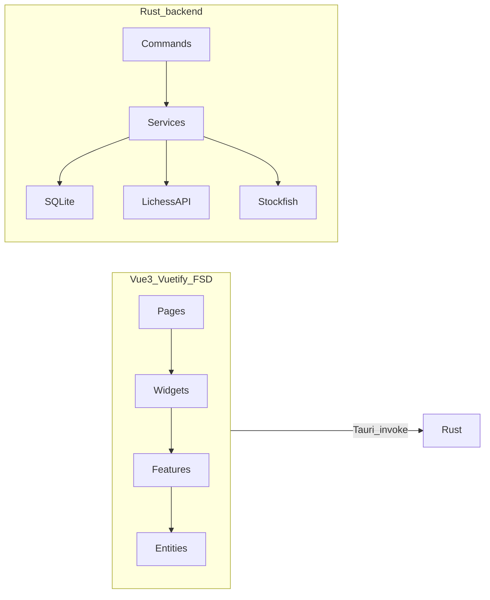

# Blindspot

**Your chess patterns, surfaced from your Lichess games.**

Blindspot is a local-first desktop app for [Lichess](https://lichess.org) players. It syncs your games, runs **Stockfish** analysis on your machine, turns results into actionable **insights**, and lets you compare yourself head-to-head in **Versus**—without sending your games to a third-party analytics cloud.

> **Note:** Blindspot is an independent project and is not affiliated with or endorsed by Lichess.

## Screenshots

Replace each `<!-- TODO(screenshot): ... -->` block below when assets are ready. Keep filenames stable under `docs/screenshots/`.

### Home dashboard

<!-- TODO(screenshot): docs/screenshots/01-home-dashboard.png
Capture: main screen after connecting a Lichess account (use one language consistently across all screenshots—EN or RU).
Frame: full application window; prefer dark theme if both themes exist.
Visible: left/nav rail with Home, Insights, My games, Versus, Settings; Blindspot branding.
Content: greeting with username; Monthly rating chart; Player profile pentagon (Your stats vs Average benchmark);
Daily insight card with confidence; Recent games or Last game section populated.
State: account with enough synced games; insights already generated; daily pick is set (not empty onboarding).
Resolution: at least 1440×900 or 1920×1080; crop sensitive data—public Lichess username only.
-->


### Insights

<!-- TODO(screenshot): docs/screenshots/02-insights-feed.png
Capture: Insights page (`/insights`).
Frame: full window or main content area with nav visible.
Content: feed of insight cards from multiple categories (e.g. openings, tactics, psychology, blunders, time controls);
severity chips or metric headlines visible on several cards; category filters visible if shown in UI.
State: after “Generate insights” has run at least once—no empty-state placeholder.
Resolution: same as other screenshots; readable card titles and one expanded metric line per card if possible.
-->


### My games

<!-- TODO(screenshot): docs/screenshots/03-my-games.png
Capture: My games page (`/my-games`).
Content: sync metadata (e.g. “N of M games”, last updated); toolbar with filters (result, color, speed, etc.);
several game rows with opponent name, rating, result, date; board preview thumbnail on a row if the list shows it.
State: synced library with multiple games—not an empty list.
Resolution: show enough rows to convey filtering and density (5–8 rows minimum).
-->


### Game analysis

<!-- TODO(screenshot): docs/screenshots/04-game-details-analysis.png
Capture: Game details for a fully analyzed game (`/game-details/:id`).
Content: hero block (players, result, time control); analysis overview (eval chart or summary);
key insight text; pattern tags; key moments list—NOT the “analysis in progress” spinner state.
State: Stockfish analysis completed and persisted locally.
Resolution: include eval visualization if present; avoid mid-scroll cut through critical widgets.
-->


### Versus

<!-- TODO(screenshot): docs/screenshots/05-versus-comparison.png
Capture: Versus page (`/versus`) after comparison finished.
Content: opponent username entered; two profile pentagons (You / Opponent); metrics comparison table;
openings compare or game-plan section if visible—NOT an empty form or progress-only state.
State: comparison complete for a real Lichess username; speed filter selected (e.g. blitz or rapid).
Resolution: both pentagons and at least one comparison table fully in frame.
-->


### Analyze board

<!-- TODO(screenshot): docs/screenshots/06-analyze-board.png
Capture: Analyze board page (`/analize-board`).
Content: interactive chessboard (chessground); engine evaluation bar or numeric eval;
position not the starting position—show a meaningful eval (e.g. middlegame).
State: engine initialized (`init_engine` succeeded); eval visible on screen.
Resolution: board large enough to read pieces; include eval UI element.
-->


### Settings

<!-- TODO(screenshot): docs/screenshots/07-settings.png
Capture: Settings page (`/settings`).
Content: Appearance block (theme, language EN/RU); Analysis settings block (depth/batch preferences as implemented);
both sections in one tall screenshot or two crops documented in repo.
State: default sensible values; no error banners.
Resolution: readable labels for theme and analysis options.
-->


## Features

- **Home** — rating history, player profile pentagon vs rating-bucket benchmarks, daily insight pick, recent games
- **Insights** — regenerated cards from your library (openings, tactics, psychology, blunder patterns, time controls, opponent rating, and more)
- **My games** — Lichess sync, filters, list with optional board preview, jump to analysis
- **Game details** — Stockfish-backed eval timeline, move classification, pattern tags, key moments
- **Versus** — compare your pentagon and stats against another Lichess username (with on-demand opponent analysis)
- **Analyze board** — standalone board with local engine evaluation
- **Settings** — appearance (theme), English/Russian UI, analysis preferences

## Privacy and data

- Games and analysis results are stored in a **local SQLite** database on your computer.
- Your Lichess **personal API token** is stored in the **OS credential keyring**, not in the database.
- Game analysis runs **locally** via a bundled Stockfish binary; positions are not sent to a Blindspot server (there is no Blindspot backend).

## Architecture



Frontend follows [Feature-Sliced Design](https://feature-sliced.design/): `src/app`, `pages`, `widgets`, `features`, `entities`, `shared`. Backend logic lives under `src-tauri/src` (`commands`, `services`, `db`, `clients`).

## Tech stack

| Layer | Technologies |
| ----- | ------------ |
| UI | Vue 3, TypeScript, Vuetify 4, Pinia, TanStack Query, Vue Router, vue-i18n |
| Desktop | Tauri 2 |
| Backend | Rust, rusqlite, shakmaty, reqwest |
| Chess | Stockfish (UCI), chess.js, chessground |
| Charts | ApexCharts |

## Prerequisites

- [Node.js](https://nodejs.org/) **20+**
- [Rust](https://www.rust-lang.org/tools/install) (stable) and [Tauri prerequisites](https://v2.tauri.app/start/prerequisites/) for your OS
- **Stockfish** binary (see below)—not committed to this repository

## Getting started

### 1. Clone and install

```bash
git clone <repository-url>
cd ChessAnalytics
npm install
```

### 2. Stockfish binary

Blindspot expects `stockfish.exe` in `src-tauri/resources/` for development and bundles it as a Tauri resource for release builds.

1. Download Stockfish for your platform from [stockfishchess.org](https://stockfishchess.org/download/).
2. Place the Windows executable at:

   ```
   src-tauri/resources/stockfish.exe
   ```

3. Stockfish is licensed separately (GPL). Blindspot’s application code is under the [MIT License](LICENSE.md); complying with Stockfish’s license is your responsibility when you redistribute the engine binary.

### 3. Run in development

```bash
npm run tauri dev
```

### 4. Production build

```bash
npm run tauri build
```

Installers and bundles are produced under `src-tauri/target/release/bundle/`.

## Connect Lichess

1. Create a **personal API access token** at [lichess.org/account/oauth/token](https://lichess.org/account/oauth/token/create) (or your account’s API token page).
2. Enable scopes that allow reading your profile and games (e.g. **Read game play** / game export—match what Lichess offers for personal tokens).
3. In Blindspot, open **Home** and paste the token into **Connect with Lichess**.
4. The token is saved in your system keyring. Use **Settings** or disconnect flows in the app to remove it.

Blindspot uses the Lichess HTTP API for:

- `GET /api/account` — your profile and ratings
- `GET /api/games/user/{username}` — NDJSON game export (your games, and opponent games in Versus when comparing)

## Development scripts

| Command | Description |
| ------- | ----------- |
| `npm run dev` | Vite dev server (web UI only) |
| `npm run tauri dev` | Full desktop app with hot reload |
| `npm run build` | Typecheck and build frontend to `dist/` |
| `npm run tauri build` | Production desktop bundle |
| `npm run lint` | ESLint with auto-fix |
| `npm run format` | Prettier |
| `npm run test` | Vitest unit tests |

## Project layout

```
src/
  app/          providers, bootstrap, shell
  pages/        routed screens
  widgets/      large UI blocks
  features/     user scenarios
  entities/     domain models and stores
  shared/       i18n, utilities, shared UI

src-tauri/
  src/commands/   Tauri command handlers
  src/services/ business logic (sync, analysis, insights, versus)
  src/db/         SQLite repositories
  resources/      benchmarks.json, stockfish.exe (local, not in git)
```

## License

Blindspot application source is licensed under the **[MIT License](LICENSE.md)**.

**Stockfish** is a third-party engine with its own license (GPL). Download and ship it according to [Stockfish’s terms](https://stockfishchess.org/download/).

## Disclaimer

Lichess® is a registered trademark of its respective owners. This project is unofficial. Chess engine trademarks belong to their authors.
